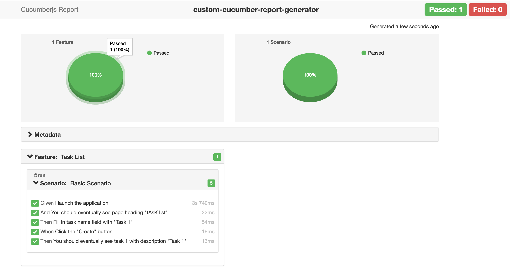

# custom-cucumber-report-generator

## Purpose
To create custom reports from user inputs. 

This uses [cucumber-html-reporter](https://www.npmjs.com/package/cucumber-html-reporter) to generate the cucumber report, and provides a wrapper around it to allow users to set file inputs.

## Installation 

```
npm install custom-cucumber-report-generator
```

or

```
yarn add custom-cucumber-report-generator
```

### Pre-requisites
 
 Require the result of cucumber test run to be saved as JSON file. The JSON file will need to be used with the `[-f]` parameter.


### Format for customising cucumber report:

JSON format from [cucumber-html-reporter](https://www.npmjs.com/package/cucumber-html-reporter)

Sample JSON:
```
{
  jsonFile: "result-from-cucumber-run.json",
  output: "path-to/name-of-report-file.html"
  screenshotsDirectory: "path-to/screenshots-dir/",
  metaData: {
    "App" : "1.0.0",
    "Env" : "Dev",
    "Browser": "Chrome",
    "OS": "MacOS"
  } 
}
```


## How to generate my report?


### Usage examples:

- Generating report (using default template option)
```
./node_modules/.bin/custom-cucumber-report-generator -f <path-to-result-json-file>
```

- Generating report (using custom template option `[-i]`)
```
./node_modules/.bin/custom-cucumber-report-generator -f <path-to-result-json-file> -i <path-to-custom-template-json-file>
```

### Default Output location
```
output/report/cucumber-report.html
```

### Optional Arguments

- Specify location to output report to `[-o]`
```
./node_modules/.bin/custom-cucumber-report-generator -f '<path-to-result-json-file' -o <output-file-path>
```

- Specify location of screenshots `[-s]`
```
./node_modules/.bin/custom-cucumber-report-generator -f '<path-to-result-json-file>' -s <path-to-screenshots>
```

## Report Output


